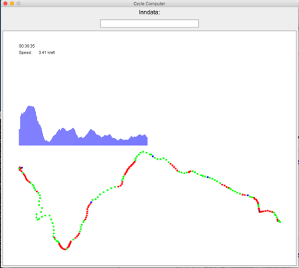

## Mål med prosjektet og startkode

Mange sykkelcomputere, sportsklokker og fitness-applikasjoner bruker GPS data dvs. informasjon om bla. tid og posisjon for å beregne statistikk som distanse, hastighet, høydemeter og til å visualisere rute og høydeprofil. Dette gjøres i programkode på enheten.

Formålet med dette prosjektet er å implementere Java-programmer som har tilsvarende funksjonalitet som en typisk sykkelcomputer. Avanserte sykkelcomputere gjør beregninger løpende basert på input data fra en GPS sensor. Java-programmene i dette prosjektet baseres på å lese GPS data fra en datafil. På den måten vil Java-programmet simulere en riktig sykkelcomputer og fungere som en slags virtuell (ikke fysisk) sykkelcomputer.

Det siste målet med prosjektet er en Java-applikasjon som bruker EasyGraphics biblioteket til løpende (live) å gi syklisten (brukeren) informasjon svarende til det som skissert på bildet nedenfor. Her er tid og aktuell hastighet vist i øverste venstre hjørne og høydeprofilen er i midten. Videre er ruten er tegnet på et kort nederst der rød angir at sykkelruten går oppover, grønn at det går nedover og blå at det er flatt.



### GPS data format

Der finnes ulike formater som kan brukes til å lagre GPS data. I dette prosjektet skal vi ta utgangs-punkt i tekstfiler som bruker en variant av *CSV* formatet (Comma-Separated-Values). Dette betyr at en datafil med eksempelvis fem GPS datapunkter representeres på følgende måte:

```
5
time,lat,lon,elevation,accuracy,bearing,speed,satellites,provider,
2017-08-13T08:52:26.000Z,60.385390,5.217217,61.9,7.0,219.93,0.94605947,0,gps
2017-08-13T08:53:00.000Z,60.385588,5.217857,56.2,11.1,0.0,0.0,0,gps
2017-08-13T08:53:57.000Z,60.385398,5.216950,56.1,10.5,0.0,0.0,0,gps
2017-08-13T08:55:55.000Z,60.383428,5.219823,57.0,5.8,143.5,4.989717,0,gps
2017-08-13T08:57:57.000Z,60.376988,5.227082,105.5,5.2,159.61,9.415813,0,gps,
```

Den første linjen inneholder et heltall (her 5) som angir hvor mange GPS datapunkter som finnes i filen. Linje nummer to gir informasjon om hvordan de etterfølgende linjer (selve GPS datapunktene) med verdier oppdelt med komma skal tolkes (betyr). Her kan vi se at først kommer informasjon om tid (time), så breddegrad (engelsk: latitude), så lengdegrad (engelsk: longitude), så høyde (engelsk: elevation), så nøyaktighet (engelsk: accuracy) osv.  

Som eksempel har vi for det første GPS datapunkt (i linje tre i filen) informasjonen at datoen var 13. august 2017 kl. 8:52:26, breddegraden var 60.305390 grader (nord pga. gradtallet er positivt) og lengdegraden var 5.217217 grader (øst pga. gradtallet er positivt). Høyden var 61.9 meter.

Datafilen forteller altså hvilke punkter vi har flyttet oss igjennom og til hvilket tidspunkt. Vi startet i punktet svarende til linje 3, så flyttet vi oss til punktet i linje 4 osv. Totalt sett har vi beveget oss gjennom fem punkter som da definerer den ruten vi har syklet.

I oppgaven skal dere bruke større GPS datafiler bla. en datafil hvor en DAT100 faglærer har vært ute og syklet på ulike deler av løypene fra VM i Bergen, 2017.

Ruten er vist her: http://doarama.com/view/1604599 der GPS datafilen er visualisert basert på en web-basert applikasjon.

### Eclipse-prosjekt for en sykkelcomputer

Dere skal ta utgangpunkt i et Eclipse-prosjekt som inneholder en rekke Java-klasser som utgjør rammen rundt en sykkelcomputer-applikasjonen. Dere trenger ikke å legge til nye klasser, men dere skal implementere ulike metoder i klassene som er gitt.

Gruppen kan få tilgang til start Java-koden via Github classroom ved å gå til følgende adresse:

https://classroom.github.com/a/rH9NpPrl

og akseptere oppgaven.

**Neste steg** er da å importere koden inn i Eclipse som beskrevet i  [Oppgave 3 på Java programmering 0](https://github.com/dat100hib/H2017/blob/master/programmering/jplab0/JP0.md#oppgave-3-github-classroom-og-junit-enhetstesting)

Hvis gruppen ønsker å bruke en felles github-oppbevaringsplass for koden, er det tilstrekkelig at en i gruppen aksepterer oppgaven via lenken ovenfor og deretter gir de andre medlemmene i gruppen tilgang til oppbevaringsplassen (repository). Dette kan gjøres ved å logge inn på www.github.com, gå til oppbevaringsplassen og via *Settings* for oppbevaringsplassen legge til de andre medlemmer i gruppen som *Collaborators*.

De andre gruppemedlemmene må da klone oppbevaringsplassen ned på egen PC ved å velge *File → Import → Git → Projects from Git → Clone URI* i Eclipse og lime inn URL’en til den felles oppbevaringsplassen. Endringer i filer i prosjektet lastes opp til den felles oppbevaringsplassen ved å bruke  *Team | Add to Index* etterfulgt av *Team | Commit … | Commit and Push* og hentes ned ved å bruke *Team | Pull*.

### Java startkoden

Eclipse-prosjektet som dere skal ta utgangspunkt i er organisert i to pakker:

- `no.hvl.dat100.prosjekt` med de klasser som inneholder metoder som gruppen skal implementere i oppgavene som presenteres nedenfor.

- `no.hvl.dat100.prosjekt.test` som inneholder en rekke enhetstester (unit-tests) implementert ved bruk av rammeverket JUnit. Det er ikke et krav i prosjektet å legge til flere enhetstes-ter.

Formålet med enhetstestene er å gjøre det enklere å teste metoder etterhvert som de implementeres uten å skulle starte selve sykkelcomputer-applikasjonen.  

Konvensjonen er at enhetstester for en klasse `X.java` er implementert i filen med navn `XTester`.java. Eksempelvis inneholder klassen `GPSUtilsTester.java` enhetstester for klassen `GPSUtils.java` hvor dere skal implementere metoder.  

### Utføre JUnit enhetstest
En test-klasse med enhetstest utføres ved å velge test-klassen etterfulgt av *Run As → JUnit Test*. Man kan kjøre alle testene i en test-pakke ved å velge pakken etterfulgt av *Run As → JUnit Test*. Alle testene i Eclipse-prosjektet kjøres ved å velge prosjektet etterfulgt av *Run As → JUnit Test*.

Det er god/anbefalt praksis å gjenta testene når det gjøres endringer/forbedringer i implementasjonen av en metode. Det anbefales også å teste etterhvert som de enkelte metoder implementeres. Enhetstestene er ikke komplette, men tester basale ting for metodene i de klasser som dere skal implementere.

Enhetstesting og test-drevet utvikling er et tema senere i studiet og det er et generelt godt ingeniørprinsipp å teste komponentene sine før de settes sammen til et større system.

De steder i koden hvor dere skal implementere Java-kode, er merket med en kommenter og teksten `TODO`. Disse plassene i koden kan lett identifiseres ved at de gir en blå markering i høyresiden av editor-vinduet i Eclipse. For å kjøre det enklere ifm. presentasjon av oppgaven å finne de plassene hvor dere har lagt til kode, anbefales det å la kommentarene med `OPPGAVE – START` og `SLUTT` bli stående i koden.  

I mappen `logs` i Eclipse-prosjektet finnes tre CSV filer filer: `short.log`, `medium.log`, `long.log` og `vm.log` med GPS data punkter som kan brukes som input til Java sykkelcomputeren.
