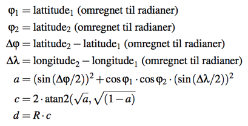
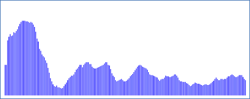
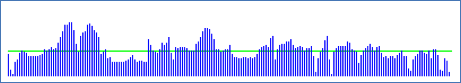
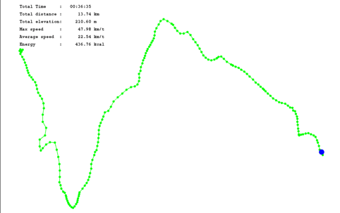

## Programmeringsoppgavene

### Oppgave 1 - GPS data innlesing/utskrift

I denne oppgaven skal dere se på klassen [GPSDataReaderWriter.java](https://github.com/dat100hib/dat100-prosjekt/blob/master/src/no/hvl/dat100/prosjekt/GPSDataReaderWriter.java) som inneholder Java-kode for å lese inn en CVS-datafil med GPS punkter i formatet forklart tidligere.

I klassen brukes fire tabeller med tekststrenger (typen String) til å representere GPS datapunktene

```java
String[] times;
String[] latitudes;
String[] longitudes;
String[] elevations;
```

Ideen er at times-tabellen brukes til å lagre tidspunktene fra GPS datapunktene, latitudes-tabellen brukes til å lagre breddegradene, longitudes-tabellen brukes til å lagre lengdegrader, og elevations-tabellen brukes til å lagre høyde. De resterende data i et GPS datapunkt skal vi ikke bruke.

Metoden

```java
public static GPSData readGPSFile(String filename)  
```

er allerede implementert og leser - linje for linje - i GPS datafilen og lagrer data i tabellene ovenfor.

Ser vi på eksemplet fra tidligere der vi hadde fem datapunkter i filen da vil tabellene ha følgende innhold etter innlesing

```java
times = { "2017-08-13T08:52:26.000Z", "2017-08-13T08:53:00.000Z",
          "2017-08-13T08:53:57.000Z", "2017-08-13T08:55:55.000Z",
          "2017-08-13T08:57:57.000Z" }

latitudes = { "60.385390", "60.385588", "60.385398", "60.383428", "60.376988" }

longitudes = { "5.217217", , "5.217857","5.216950", "5.219823", "5.227082" }

elevations = { "61.9", "56.2", "56.1","57.0", "105.5" }

```

Dvs. informasjonen fra første GPS datapunkt står på indeks (posision) 0 i tabellen ovenfor, informasjon fra andre GPS datapunkt finnes på indeks 1 osv.

#### 1a)

Se på koden for `readGPSFile`-metoden for å forstå hvordan den virker.

I klassen finnes starten på en metode

```java
public static void printGPSData(GPSData gpsdata)
```

som skal skrive det innleste GPS data ut på skjermen (Eclipse Console-vinduet). Metoden bruker en for-løkke for å gå igjennom alle elementene i times-tabellen for å skrive disse ut på skjermen.

Hvis du kjører main-metoden i `GPSDataReaderWriter`-klassen, vil du se utskriften i Console-vinduet.

#### 1b)

Utvid implementasjonen av `printGPSData`-metoden slik at også innhold fra de tre andre tabellene også skrives ut.

For den ferdige implementasjonen skal begynnelsen på utskriften i Console-vinduet se slik ut

```
19
time,latitude,longitude,elevation
2017-08-13T08:52:26.000Z,60.385390,5.217217,61.9
2017-08-13T08:53:00.000Z,60.385588,5.217857,56.2
2017-08-13T08:53:57.000Z,60.385398,5.216950,56.1
2017-08-13T08:55:55.000Z,60.383428,5.219823,57.0
2017-08-13T08:57:57.000Z,60.376988,5.227082,105.5
```

### Oppgave 2 - Konvertering av GPS data fra tekststrenger til tall

I oppgave 1 har vi sett at GPS datafilen kan leses inn og GPS datapunkter kan representeres ved å bruke fire tabeller med strenger. For å kunne gjøre beregninger på GPS dataene må vi konvertere strengene med data til tall.

Formålet med klassen [GPSDataConverter.java](https://github.com/dat100hib/dat100-prosjekt/blob/master/src/no/hvl/dat100/prosjekt/GPSDataConverter.java) er å implementere metoder som kan gjøre denne konverteringen.

I klassen finnes fire tabeller

```java
private String[] timesstr, latitudesstr, longitudesstr, elevationsstr;
```

som inneholder streng-representasjon av GPS data (som forklart i oppgave 1) og vi skal nå konvertere disse data og lagre informasjonen i fire nye tabeller

```java
public int[] times;
public double[] latitudes, longitudes, elevations;
```

Ser vi på et eksempel GPS datapunkt skal vi altså konvertere

- Strengen `"2017-08-13T08:52:26.000Z"` til heltallet (int) `31946` som angir antall sekunder fra midnatt.
- Strengen `"60.385390"` til flyttallet (double) `60.385390`
-	Strengen `"5.217217"` til flyttallet (double) `5.217217`
-	Strengen `"61.9"` til flyttallet `61.9`

Dette skal gjøres for alle elementer i tabellene.

Ser vi eksempelvis på latitudesstr-tabellen med strenger

```java
latitudesstr = { "60.385390", "60.385588", "60.385398", "60.383428", "60.376988" }
```

da skal denne konverteres til en latitude-tabellen av tal som ser slik ut

```java
latitudes = { 60.385390, 60.385588, 60.385398, 60.383428, 60.376988}
```

#### 2a)

Metoden ```public void convert()``` i klassen GPSDataConverter inneholder starten på kode som kan gjøre denne konverteringen.

Utvid convert-metoden slik den konverterer breddegrader, lengdegrader og høyder.

#### 2b)

Gjør ferdig implementasjon av `toSeconds`-metoden som omregner tidsdata til antall sekunder og bruk den i `convert`-metoden slik at tidsinformasjonen også blir konvertert.

Klassen [GPSDataConverterTester.java](https://github.com/dat100hib/dat100-prosjekt/blob/master/src/no/hvl/dat100/prosjekt/test/GPSDataConverterTester.java) inneholder en rekke enhetstest som du kan bruke til å teste implementasjonen din.

#### 2c)

Til slutt skal dere implementere metoden `print()` som skal skrive ut det konverterte data. Denne metoden vil også bli kjørt av enhetstestene og begynnelsen av utskriften skal se slik ut

```
long
Konvertert GPS Data
31946 (60.38539,5.217217) 61.9
31980 (60.385588,5.217857) 56.2
32037 (60.385398,5.21695) 56.1
32155 (60.383428,5.219823) 57.0
32277 (60.376988,5.227082) 105.5
32406 (60.370383,5.23205) 49.7
32527 (60.359813,5.237472) 40.2
32651 (60.361153,5.243403) 70.4
```

#### 2d)

Sjekk at første delen av utskriften stemmer overens med innholdet i log-datafilen som blev lest inn.

### Oppgave 3 - GPS hjelpemetoder

Nå kan vi lese inn GPS data og konvertere det det tall som vi kan gjøre beregninger på. I første omgang skal vi implementere noen hjelpe-metoder i klassen [GPSUtils.java](https://github.com/dat100hib/dat100-prosjekt/blob/master/src/no/hvl/dat100/prosjekt/GPSUtils.java) som vi skal bruke seinere i prosjektet.


Gjør ferdig implementasjonen av følgende metoder i klassen og bruk enhetstestene i klassen `GPSUtils.java` til løpende å teste koden.

#### 3a)

```java
double findMin(double[] da)
```

som finner minste tall i en tabell med flyttall. **Hint:** se på implementasjonen av metoden findMax i klassen.

#### 3b)

```java
double distance(double latitude1, double longitude1,
          double latitude2, double longitude2)
```

som bruker Math-klassen: https://docs.oracle.com/javase/8/docs/api/java/lang/Math.html

til å beregne avstanden *d* i meter mellom to punkter på jordkloden ved bruk av Haversine-formlen



der *R = 6371000* meter er jordens gjennomsnittsradius.

```java
double speed(int secs,
             double latitude1, double longitude1,        
             double latitude2, double longitude2)
```

som beregninger gjennomsnittshastighet i km/t om man beveger seg fra punktet gitt ved (latitude1,longitude1) til punktet (latitude2,longitude2) på det antall sekunder som er gitt med parameteren secs.

#### 3c)

```java
String printDouble(double d)
```

som runder av et flyttall til to desimaler, setter resultat inn i en streng og fyller på med mellomrom foran i strengen slik at lengden på strengen blir 10 (se eksempel i koden).

#### 3d)

```java
public static String printTime(int secs)
```

som returnerer en streng der tiden i sekunder fra midnatt gitt av parameteren secs på formatet `hh:mm:ss` der `hh` er antall timer, `mm` er antall minutter og `ss` er antall sekunder.

### Oppgave 4: GPS-basert statistikk

I klassen [GPSComputer.java](https://github.com/dat100hib/dat100-prosjekt/blob/master/src/no/hvl/dat100/prosjekt/GPSComputer.java) skal dere implementere metoder som beregner statistikk (nøkkeltall) basert på de innleste og konverterte GPS data.

I forbindelse med implementasjonen bør dere tenke på om der allerede finnes metoder fra tidligere oppgaver eller denne deloppgaven som kan brukes i løsningen.

Klassen `GPSComputer.java` inneholder fire tabeller

```java
public int[] times;
public double[] latitudes;
public double[] longitudes;
public double[] elevations;
```

med konvertert GPS data og metodene som dere skal implementere skal bruke data fra disse fire tabellene til å gjøre beregninger.

Følgende metoder skal implementeres

#### 4a)

```java
public double totalDistance()
```

som beregner den totale distansen på ruten som GPS dataene angir. Dvs. metoden må legge sammen avstanden mellom de punktene vi har beveget oss igjennom på ruten.

#### 4b)

```java
public double totalElevation()
```

som beregner det totale antall høydemeter på ruten. Husk at vi skal kun telle høydemeter mellom to punkter om vi beveger oss oppover.

#### 4c)

```java
public int totalTime()
```

som skal beregne den totale tiden det har tatt å sykle ruten svarende til de innleste GPS data.

#### 4d)

```java
public double[] speeds()
```

som skal returnere en tabell med gjennomsnitshastigheter mellom hver av de punktene vi har beveget oss mellom. Dvs. første inngang i tabellen skal være hastigheten vi beveget oss med mellom punkt 0 og punkt 1, andre inngang hastigheten mellom punkt 1 og 2 osv. Hvis antall GPS datapunker er N da vil lengden av den tabellen som returneres være N-1.

**Hint:** kan du bruke noe fra klassen `GPSUtils.java`?

#### 4e)

```java
public double maxSpeed()
```

som returnerer den største hastigheten vi har beveget oss med mellom to punkter på ruten.

#### 4f)

```java
public double averageSpeed()
```

som returnerer gjennomsnittshastigheten vi har beveget oss med total sett for hele ruten.  

#### 4g)

```java
public double kcal(double weight, int secs, double speed)
```

som kan beregnere hvor mye energi vi har forbrent gitt vekten vår og at vi beveger os med en gitt hastighet i antall sekunder.

For å kunne estimere energi-forbrenningen i kilo-kalorier (kcal) skal vi først finne *MET* (Metabolic Equivalent of Task)  som er et fysiologisk mål for hvor mange kcal vi forbrenner per kilo kroppsvekt per time ved en gitt aktivitet. MET avhenger av type aktivitet og intensitet. For sykling [ http://coachlevi.com/health/calories-burned-bicycling/ ] er den gitt i tabellen nedenfor der hastighet er angitt i miles per hour (mps):

```
Hastighet	MET
<10 mph	4.0
10-12 mph	6.0
12-14 mph	8.0
14-16 mph	10.0
16-20 mph	12.0
>20 mph	16.0
```

Hastighet i km/t kan omregnes til mph ved å gange med en faktor *0.62*. MET vil også avhenge av eks. stigningsprosent (om det går opp eller ned og hvor mye) men det skal vi se bort fra her.

#### 4h)

```java
public double totalKcal(double weight)
```

som beregner den totale energy-mengden som er forbrent på ruten.

#### 4i)

```java
public void print()
```

som skriver ut statistikken som er beregnet av metodene i klassen. Formatet på utskriften skal være slik:

```
GPS datafile: medium
Total Time     :   00:36:35
Total distance :      13.74 km
Total elevation:     210.60 m
Max speed      :      47.98 km/t
Average speed  :      22.54 km/t
Energy         :     742.80 kcal
```

### Oppgave 5 - Visualisering av høyde profil

I denne oppgaven skal EasyGraphics-biblioteket brukes til å visualisere høyde-kurven for ruten gitt ved GPS datapunktene. For GPS datafilen `medium.log` skal visualiseringen se ut som nedenfor der høyden på en vertikal linje svarer til høyden i GPS datapunktet.



I klassen [showProfile.java](https://github.com/dat100hib/dat100-prosjekt/blob/master/src/no/hvl/dat100/prosjekt/ShowProfile.java) finnes allerede en main-metode som setter opp et vindu som kan brukes til å tegne høydeprofilen og som ber om navn på den datafil som skal visualiseres (short, medium, long).

Klassen sørger allerede for å lese inn data fra GPS datafilen ved oppstart og lagre data i følgende tabeller som finnes i klassen

```java
private static int[] times;
private static double[] latitudes;
private static double[] longitudes;
private static double[] elevations;
```

Implementer metoden

```java
showHeightProfile(int ybase)
```

som tegner høydeprofilen der parameteren ybase angir hvor på y-aksen bunnen av en søyle skal starte.

For å gjøre oppgaven enklere kan det antas at hvert punkt (pixel) i vinduet svarer til en høyde-meter. Negative høyder skal ignoreres – dvs. behandles som om de hadde verdien 0.

**Hint:** Husk at EasyGraphics bilioteket sitt koordinatsystem har punktet (0,0) i øverste venstre hjørne og se på koden for [Oppgave 6 på programmeringslab 3](https://github.com/dat100hib/H2017/blob/master/programmering/jplab3/JP3.md#oppgave-6-søylediagram).

Dokumentasjon for metodene i EasyGraphics-bibliotekt kan finnes her

https://dbsys.info/programmering/easygraphics/javadoc/index.html

### Oppgave 6 - Visualisering av hastighet

I denne oppgaven skal EasyGraphics brukes til å visualisere hastigheten der blev kjørt med i løpet av ruten. For GPS datafilen `medium.log` skal visualiseringen se slik ut



der denne grønne linjen indikerer gjennomsnittshastigheten for hele ruten.

Ferdiggjør implementasjonen av metoden showSpeedProfile i klassen [ShowSpeed.java](https://github.com/dat100hib/dat100-prosjekt/blob/master/src/no/hvl/dat100/prosjekt/ShowSpeed.java).

Der finnes allerede en main-metode i klassen som setter opp vindu og som kaller metoden showSpeedProfile. GPS data blir automatisk lest inn i tabeller med samme navn som i oppgave 5.

### Oppgave 7 - Visualisering av sykkelruten

I denne oppgaven skal EasyGraphics brukes til å visualisere ruten på et kart og til slutt skrive ut statistikk (nøkkeltall) om sykkelturen i øverste venstre hjørne. Et eksempel er vist nedenfor for log filen `medium.log`.



Y-aksen svarer til breddegrader og x-aksen svarer til lengdegrader.

Ferdiggjør implementasjonen av følgende metoder i klassen [ShowRoute.java](https://github.com/dat100hib/dat100-prosjekt/blob/master/src/no/hvl/dat100/prosjekt/ShowRoute.java).

Der finnes allerede en main-metode i klassen som setter opp vindu og som kaller de tre metodene `ShowRouteMap`, `ShowStatistics` og `PlayRoute`.

#### 7a)

```java
public double ystep()
```

som beregner hvor mange punkter (pixels) en breddegrad skal svare til for at vi kan tegne alle GPS datapunkter innen for et tegneområde på skjermen med et antall punkter i y-retningen som er gitt ved konstanten `MAPYSIZE`.

**Hint:** se implementasjonen av metoden `xstep()`. Vi antar her at jorden er flat dvs. en lengde og en breddegrad svarer til samme avstand uansett hvor vi befinner oss. Al den stund vi ikke sykler over veldig lange avstander er det en rimelig antagelse.

#### 7b)

```java
showRouteMap(int ybase)
```

som tegner punkter i vinduet svarende til de (lengdegrad,breddegrad) posisjoner som finnes i GPS datafilen. Parameteren `ybase` angir det sted på y-aksen som skal svare til den minste breddegrad som finnes i datafilen.

#### 7c)

```java
public void showStatistics()
```

som viser statistikk fra sykkelturen i øverste venstre hjørne (se bildet først i oppgaven ovenfor).
